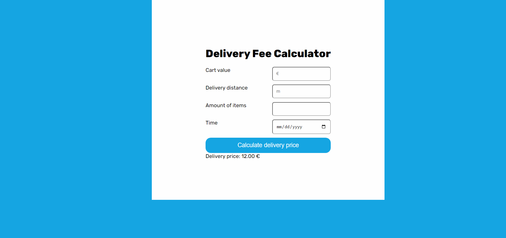

[![Contributors][contributors-shield]][contributors-url]
[![Forks][forks-shield]][forks-url]
[![Stargazers][stars-shield]][stars-url]
[![Issues][issues-shield]][issues-url]
[![MIT License][license-shield]][license-url]
[![LinkedIn][linkedin-shield]][linkedin-url]

<br />
<div align="center">
  <h3 align="center">Wolt Delivery Calculator</h3>

  <p align="center">
    <br />
    <a href="https://github.com/AlikiKap/wolt-delivery-calculator.git"><strong>Explore the docs »</strong></a>
    <br />
    <br />
    <a href="https://alikikap.github.io/wolt-delivery-calculator/">View Demo</a>
    ·
    <a href="https://github.com/AlikiKap/wolt-delivery-calculator/issues">Report Bug</a>
    ·
    <a href="https://github.com/AlikiKap/wolt-delivery-calculator/issues">Request Feature</a>
  </p>
</div>




## Table of contents
1. [About The Project](#about-the-project)
   *[Task](#task)
    * [Built With](#built-with)
2. [Installation](#installation)
3. [Usage](#usage)
4. [License](#license)
5. [Contact](#contact)
## About The Project

This Project was a test task from Wolt. The task was to implement a service where it would be possible for a user to calculate the price of the delivery according to the following rules:
* If the cart value is less than 10€, a small order surcharge is added to the delivery price. The surcharge is the difference between the cart value and 10€. For example if the cart value is 8.90€, the surcharge will be 1.10€.
* A delivery fee for the first 1000 meters (=1km) is 2€. If the delivery distance is longer than that, 1€ is added for every additional 500 meters that the courier needs to travel before reaching the destination. Even if the distance would be shorter than 500 meters, the minimum fee is always 1€.
* If the number of items is five or more, an additional 50 cent surcharge is added for each item above and including the fifth item. An extra "bulk" fee applies for more than 12 items of 1,20€
* The delivery fee can never be more than 15€, including possible surcharges.
* The delivery is free (0€) when the cart value is equal or more than 100€.
* During the Friday rush (3 - 7 PM UTC), the delivery fee (the total fee including possible surcharges) will be multiplied by 1.2x. However, the fee still cannot be more than the max (15€).
Demo: https://alikikap.github.io/wolt-delivery-calculator/
### Task
https://github.com/woltapp/engineering-summer-intern-2023
### Built With
* [![React][React.js]][React-url]
* 

<p align="right">(<a href="#readme-top">back to top</a>)</p>

## Installation

Follow these steps to get the project up and running on your local machine:

Clone the repository:

```bash
  git clone https://github.com/AlikiKap/wolt-delivery-calculator.git
```
Navigate to the project directory:
```bash
  cd wolt-delivery-calculator
```
Install the dependencies:
```bash
  npm install
```
## Usage

Once you have installed the dependencies, you can start the development server:

```bash
  npm run start
```
This will start the application in development mode, and you can access it in your web browser at http://localhost:3000.
<br/>
<!-- LICENSE -->
## License

Distributed under the MIT License. See `LICENSE.txt` for more information.

<p align="right">(<a href="#readme-top">back to top</a>)</p>


## Contact

Aliki Kapasakalidi - [@AlikiKap](https://www.linkedin.com/in/aliki-kapasakalidi-921891203/) - aliki02.kapasakalidi@gmail.com

Project Link: [https://github.com/AlikiKap/wolt-delivery-calculator.git](https://github.com/AlikiKap/wolt-delivery-calculator.git)

<p align="right">(<a href="#readme-top">back to top</a>)</p>


[contributors-shield]: https://img.shields.io/github/contributors/AlikiKap/wolt-delivery-calculator.svg?style=for-the-badge
[contributors-url]: https://github.com/AlikiKap/wolt-delivery-calculator/graphs/contributors
[forks-shield]: https://img.shields.io/github/forks/AlikiKap/wolt-delivery-calculator.svg?style=for-the-badge
[forks-url]: https://github.com/AlikiKap/wolt-delivery-calculator/network/members
[stars-shield]: https://img.shields.io/github/stars/AlikiKap/wolt-delivery-calculator.svg?style=for-the-badge
[stars-url]: https://github.com/AlikiKap/wolt-delivery-calculator/stargazers
[issues-shield]: https://img.shields.io/github/issues/AlikiKap/wolt-delivery-calculator.svg?style=for-the-badge
[issues-url]: https://github.com/AlikiKap/wolt-delivery-calculator/issues
[license-shield]: https://img.shields.io/github/license/AlikiKap/wolt-delivery-calculator.svg?style=for-the-badge
[license-url]: https://github.com/AlikiKap/wolt-delivery-calculator/blob/main/LICENSE
[linkedin-shield]: https://img.shields.io/badge/-LinkedIn-black.svg?style=for-the-badge&logo=linkedin&colorB=555
[linkedin-url]: https://www.linkedin.com/in/aliki-kapasakalidi-921891203/
[product-screenshot]: images/screenshot.png
[React.js]: https://img.shields.io/badge/React-20232A?style=for-the-badge&logo=react&logoColor=61DAFB
[React-url]: https://reactjs.org/
